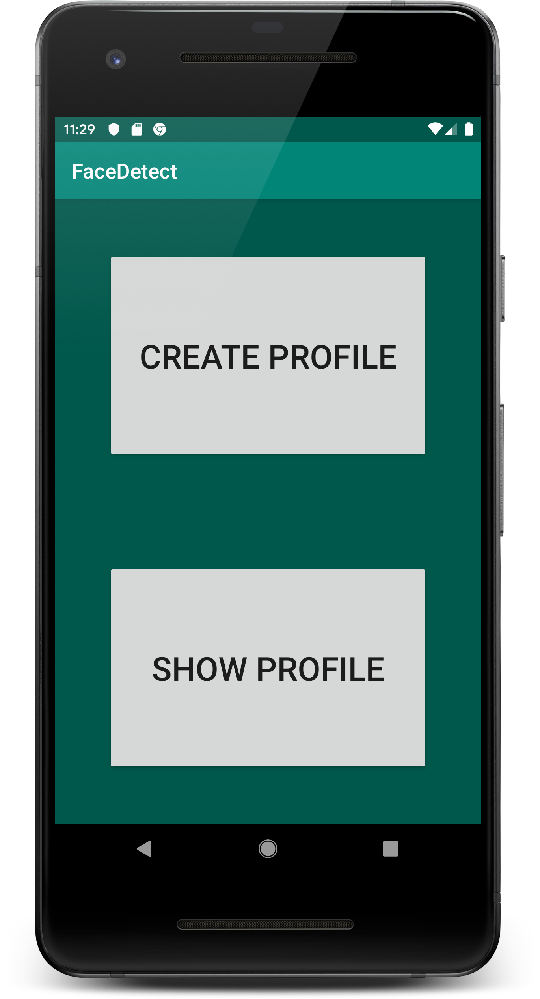
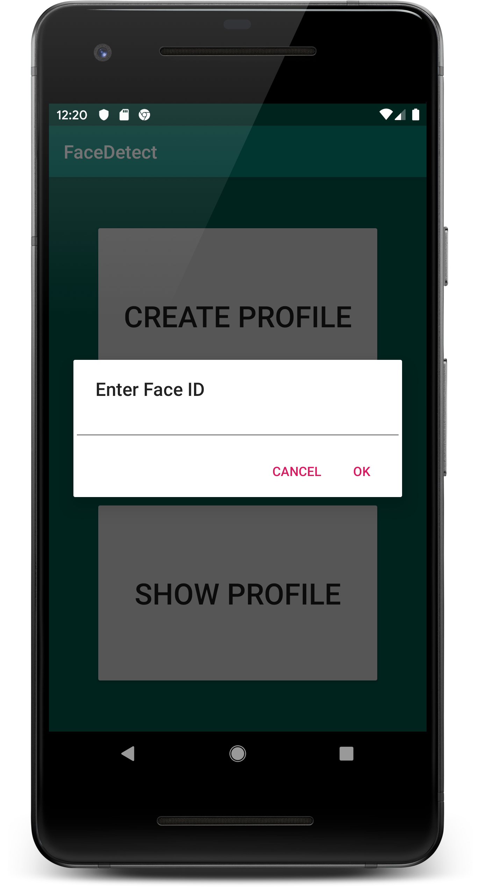
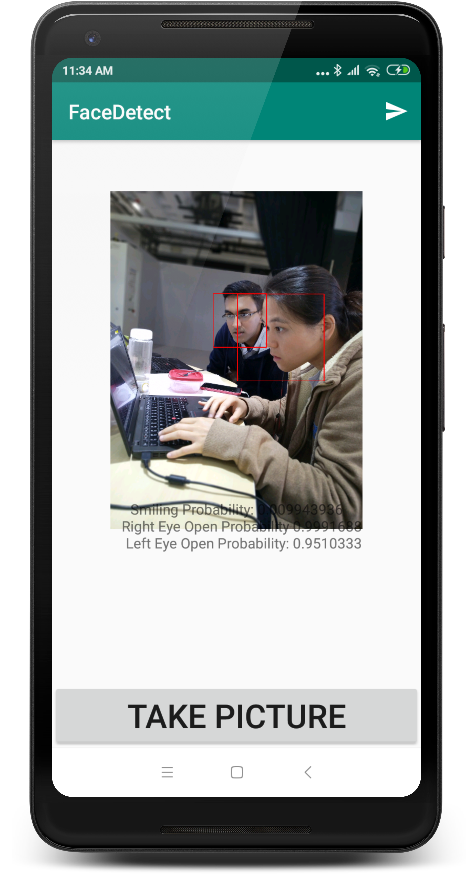

# FaceDetect
## An Android Application for detecting and registering face profiles With FaceMe backend.

### 1. Home Screen
<p align="center">
  
</p>

- Home Screen can be used to load or create a new Face Profile. Clicking Show Profile brings up a dialog where FaceID is to be entered.
- On entering FaceID, a GET request is launched and image is displayed in LoadImageActivity.java.

<p align="center">
  
</p>

Standard backend URL is:  
- Image Show URL
```
http://192.168.7.115/api/v1/showface/image/  
```
- Profile Show URL
```
http://192.168.7.115/api/v1/showface/profile/  
```
### 2. Detect Page

<p align="center">
  
</p>

- DetectActivity.java is responsible for the following tasks:
  - Capturing image using Androidx camera API
  - Detecting face and drawing bounding box using Firebase FaceDetect API
  - Posting profile JSON and image (encoded in multipart-form-data) to backend
  
  Example of profile JSON
  ```json
  {"person_name":"donna chim","person_id":"donnachim","photo_name":"donnachim","photo_url":"http://192.168.7.115/api/v1/showface/image/nourl/donnachim/"
  ,"rectangle_vector":{"x":577.979736328125,"y":349.3026123046875,"width":1052.13232421875,"height":823.4552001953125}}
  ```
- Multipart POST is done with [Android Async-HTTP](https://loopj.com/android-async-http/). With async-http, image upload is done
on a worker thread. A progressdialog is displayed during all network operations.
